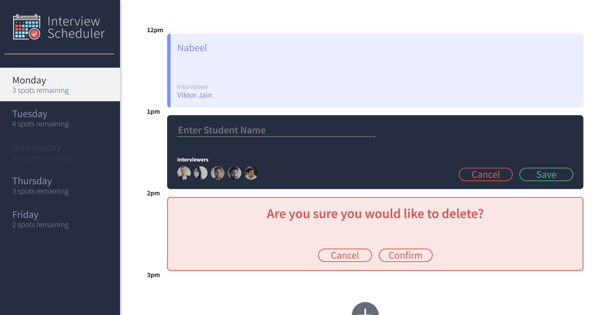

# Interview Scheduler

Scheduler Application for booking an interviews with mentors.

## Setup

Install dependencies with `npm install`.

## Running Webpack Development Server

```sh
npm start
```

## Walkthrough && Screenshots



## Running Jest Test Framework

```sh
npm test
```

## Running Storybook Visual Testbed

```sh
npm run storybook
```

## Dependencies

- axios
- classnames
- normalize.css
- react
- react-dom
- react-scripts

dev.dependencies

- @babel/core
- @storybook/addon-actions
- @storybook/addon-backgrounds
- @storybook/addon-links
- @storybook/addons
- @storybook/react
- @testing-library/jest-dom
- @testing-library/react
- @testing-library/react-hooks
- babel-loader
- prop-types
- react-test-renderer
- sass
